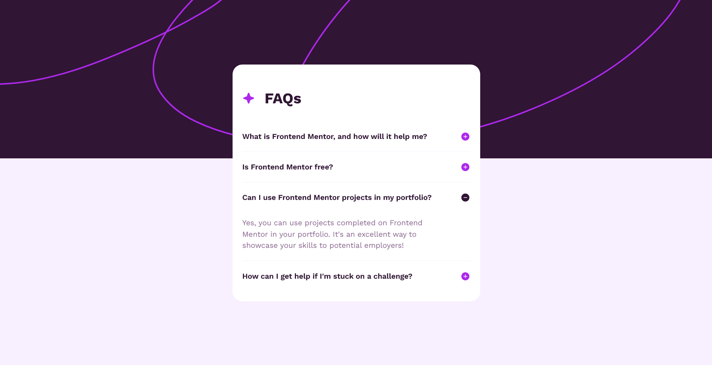

# Frontend Mentor - FAQ accordion solution

This is a solution to the [FAQ accordion challenge on Frontend Mentor](https://www.frontendmentor.io/challenges/faq-accordion-wyfFdeBwBz). Frontend Mentor challenges help you improve your coding skills by building realistic projects.

## Table of contents

- [Overview](#overview)
  - [The challenge](#the-challenge)
  - [Screenshot](#screenshot)
  - [Links](#links)
- [My process](#my-process)
  - [Built with](#built-with)
  - [What I learned](#what-i-learned)
  - [Continued development](#continued-development)
  - [Useful resources](#useful-resources)
- [Author](#author)
- [Acknowledgments](#acknowledgments)

**Note: Delete this note and update the table of contents based on what sections you keep.**

## Overview

### The challenge

Users should be able to:

- Hide/Show the answer to a question when the question is clicked
- Navigate the questions and hide/show answers using keyboard navigation alone
- View the optimal layout for the interface depending on their device's screen size
- See hover and focus states for all interactive elements on the page

### Screenshot



### Links

- Solution URL: [Add solution URL here](https://your-solution-url.com)
- Live Site URL: [Add live site URL here](https://your-live-site-url.com)

## My process

### Built with

- Semantic HTML5 markup
- CSS custom properties
- Flexbox
- CSS Grid
- Mobile-first workflow
- Pure JavaScript

### What I learned

learnt how to play with classList object to hide and show elements.

````js
      document.querySelectorAll(".question span").forEach((q) => {
        q.onclick = function () {
          if (
            this.parentElement.nextElementSibling.classList.contains("hidden")
          ) {
            document
              .querySelectorAll(".answer")
              .forEach((ans) => ans.classList.add("hidden"));
            document
              .querySelectorAll(".plus")
              .forEach((ans) => ans.classList.remove("hidden"));
            document
              .querySelectorAll(".minus")
              .forEach((ans) => ans.classList.add("hidden"));
          }
          this.parentElement.nextElementSibling.classList.toggle("hidden");
          this.nextElementSibling.classList.toggle("hidden");
          this.nextElementSibling.nextElementSibling.classList.toggle("hidden");
        };
      });
      ```


### Continued development


## Author

- Frontend Mentor - [@YahiaG](https://www.frontendmentor.io/profile/YahiaG)
- LinkedIn - [@Yahia Ali](https://www.linkedin.com/in/yahia-ali-67b8b52b5/)

````
